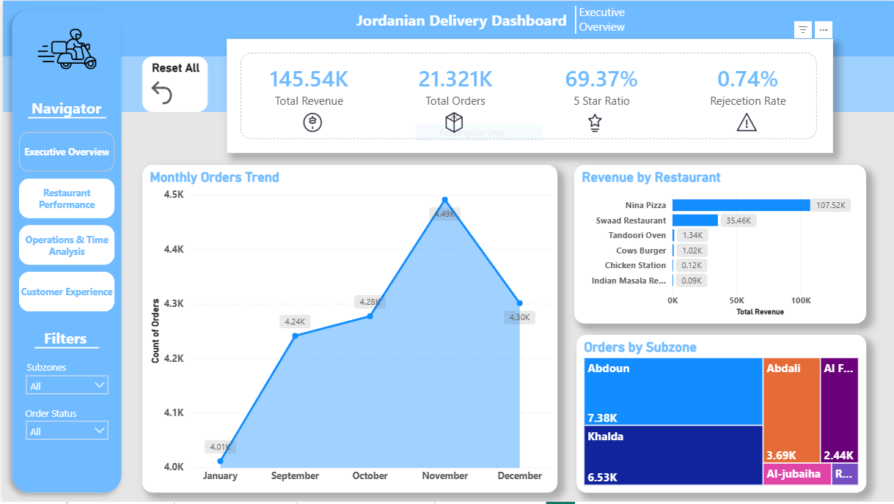
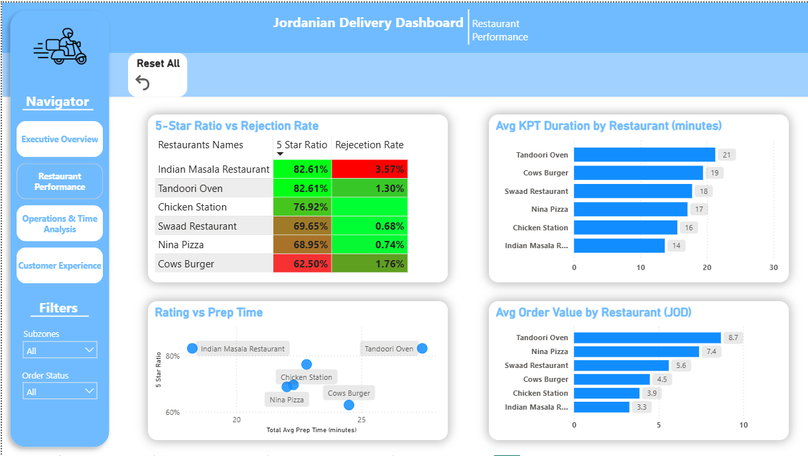
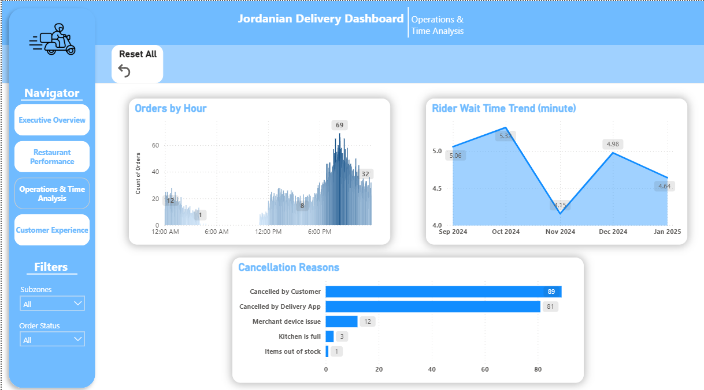
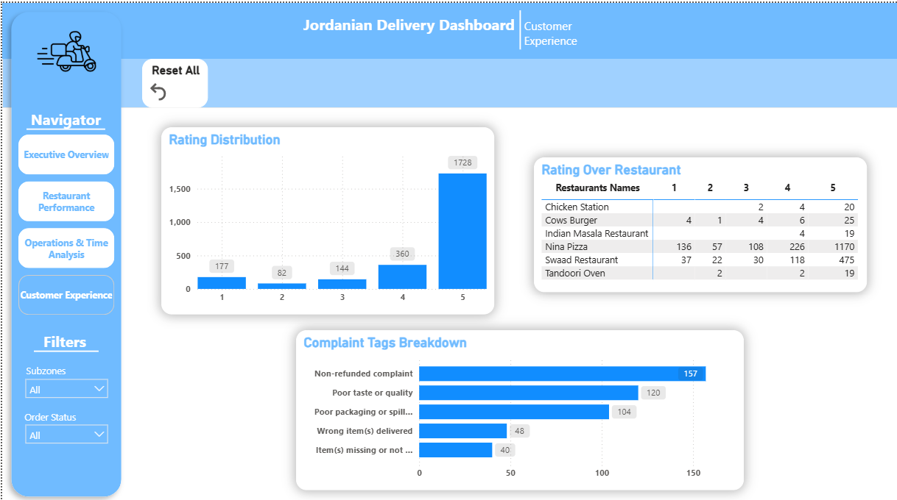
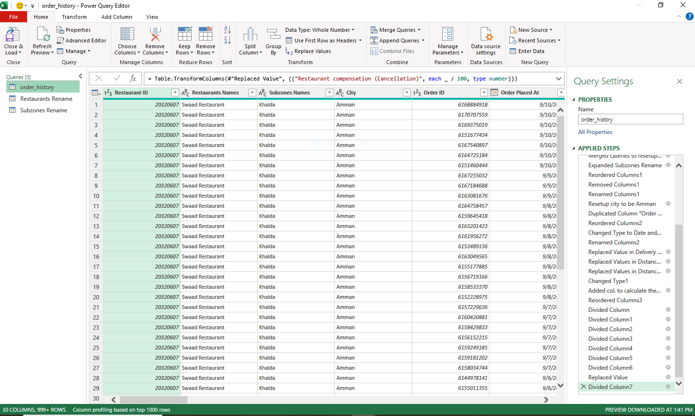
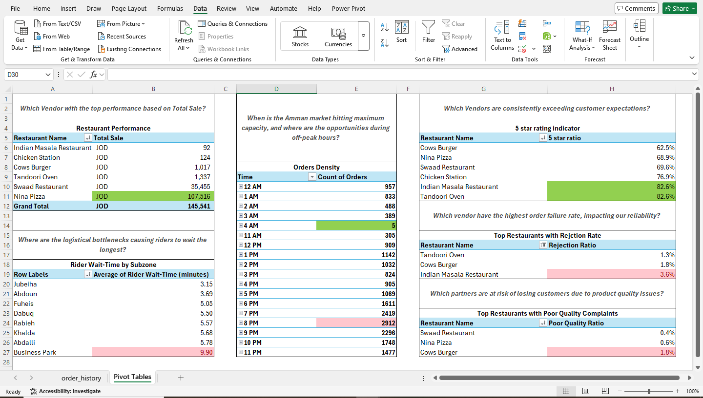

#  Jordan Food Delivery Analysis | End-to-End Data Portfolio

##  Project Overview
This project presents a comprehensive data analysis of food delivery operations, localized for **Amman, Jordan**. The project covers the entire data lifecycle: from raw data extraction and heavy cleaning in Excel to advanced visualization and storytelling in Power BI.

The main challenge was a complete **Geographic and Brand Transformation**, converting a global dataset into a localized Jordanian context with specific subzones and restaurant brands.

---

##  Tech Stack & Skills
* **Excel (The Power House):** Performed 95% of data cleaning and ETL using **Power Query**. Used **Pivot Tables** for initial data exploration (EDA).
* **Power BI:** Developed an interactive dashboard with custom navigation and advanced DAX measures.
* **Localization:** Mapped global data to Amman's subzones (Abdali, Khalda, etc.) and rebranded entities to fit the local market.

---

##  Repository Structure
* **`01-Raw-Data`**: The initial unrefined dataset.
* **`02-Processing-Excel`**: Contains the core Excel workbook where all Power Query transformations and Pivot analysis were conducted.
* **`03-Final-Dashboard`**: The finalized `.pbix` Power BI file.
* **`04-Screenshots`**: High-resolution captures of the analysis phases and final dashboard pages.

---

##  Visual Deep Dive

###  Executive Summary
Focused on high-level KPIs like Total Orders, Revenue, and overall performance trends.

###  Operational Performance
A critical look at performance trends and key metrics across different dimensions.

###  Operational Red Flags (Cancellations)
Detailed analysis of why orders fail, focusing on cancellations and rejections.

###  Customer Experience & Ratings
Analyzing customer satisfaction levels and feedback to improve service quality.

###  Behind the Scenes (ETL & Analysis)
Showcasing the heavy lifting done in **Power Query** and **Pivot Tables** to ensure data integrity.

---

##  Key Business Insights
* **Market Localization:** Successfully rebranded the dataset to reflect the Jordanian delivery landscape.
* **Efficiency Gaps:** Identified specific areas for operational improvement based on order statuses.
* **Strategic Recommendations:** Provided a clear breakdown of metrics to help management target specific service issues.

---
**Contact:** (https://www.linkedin.com/in/hamza-halaiqa)
